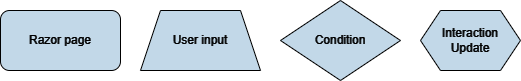
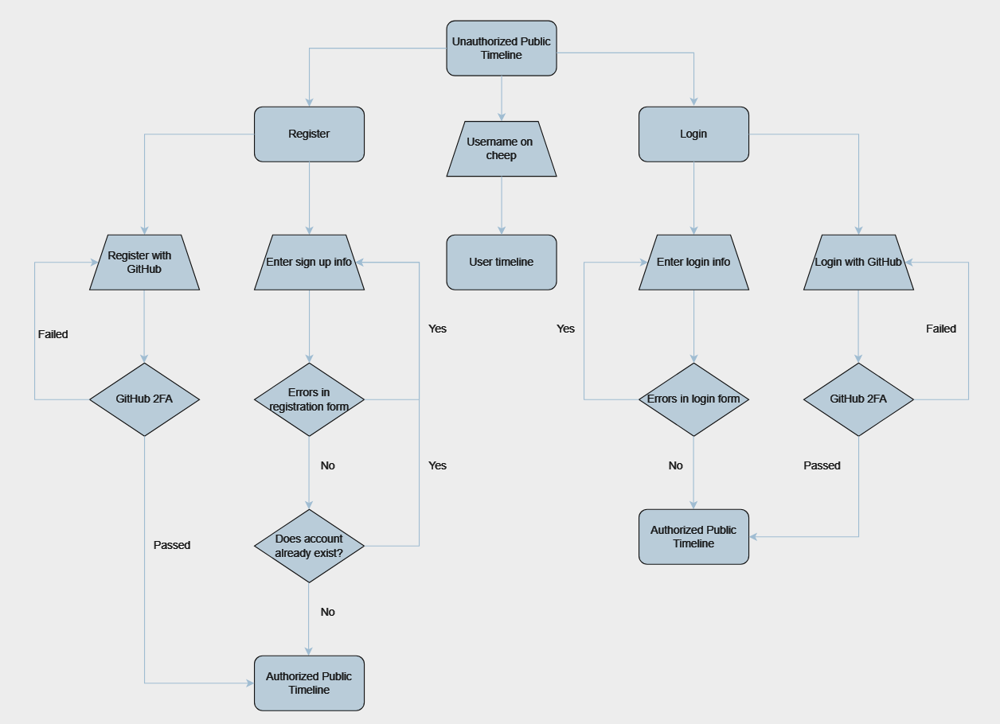
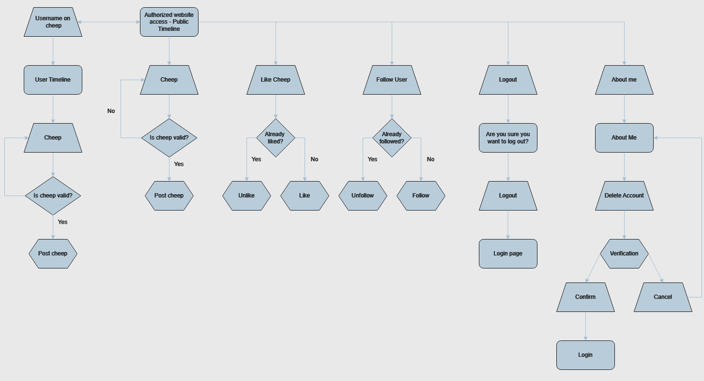
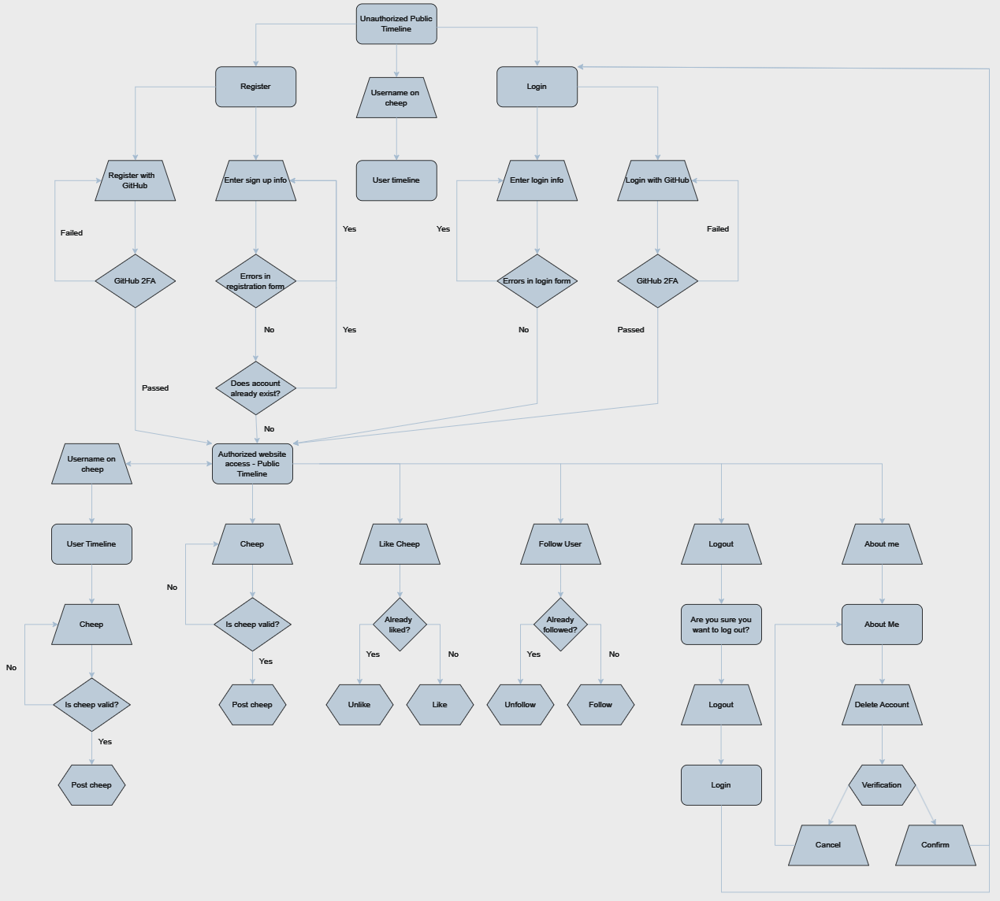

---
title: Chirp - Project Report
subtitle: Group 23 2024
authors:
- "Axel Lund <axlu@itu.dk>"
- "Victor Memborg <vmem@itu.dk>"
- "Peter Hansen <pbjh@itu.dk>"
- "Philip Rosenhagen <phro@itu.dk>"
- "Kasper Jønsson <kasjo@itu.dk>"
numbersection: true
---  

## Design and architecture

### Domain model

- Provide an illustration of your domain model.
- Make sure that it is correct and complete.
- In case you are using ASP.NET Identity, make sure to illustrate that accordingly.

### Architecture — In the small
The architecture of our Chirp application is based on the "Onion Architecture" pattern. This pattern is a layered architecture that enforces seperation of concers and invites a clear dependency flow. The following diagram illustrates the layers of our application and the dependencies between them:


At the center of the application is the **Core** layer. This layer contains the domain model, interfaces, and DTOs. As seen in the diagram, the "Core" layer is dependent on nothing, but is depended on by many other layers. This is, as mentioned, a key principle of the Onion Architecture pattern.

The **Infrastructure** layer is responsible for data access, migrations, seeding, and our services. This layer is dependent on the **Core** layer, as it needs to interact with the domain model. 

The outermost layer is the **Web** layer. This layer is resposible for delivering the application to the user. It uses ASP.NET Core to handle HTTP requests and is responsible for rendering the pages. Furthermore, it has the application's entry point, the `Program` class, which is responsible for configuring the application and starting the server.

### Architecture of deployed application

- Illustrate the architecture of your deployed application.
- Remember, you developed a client-server application.
- Illustrate the server component and to where it is deployed, illustrate a client component, and show how these communicate with each other.

### User activities

- Illustrate typical scenarios of a user journey through your _Chirp!_ application.
- That is, start illustrating the first page that is presented to a non-authorized user, illustrate what a non-authorized user can do with your _Chirp!_ application, and finally illustrate what a user can do after authentication.

- Make sure that the illustrations are in line with the actual behavior of your application.

Before showing how a user can traverse the chirp application, the diagram is going to follow these annotations:



To show what a user can do while being logged out, we have made a 'Unauthorized' UML diagram:



When a user has logged in or signed up, they now have authorized access. This grants the user more possibilities on the Chirp platform visualized in the 'Authorized' UML diagram:



To see the full picture of how it works together the whole application is laid out in 'Complete' UML diagram:



### Sequence of functionality/calls trough _Chirp!_

- With a UML sequence diagram, illustrate the flow of messages and data through your _Chirp!_ application.
- Start with an HTTP request that is send by an unauthorized user to the root endpoint of your application and end with the completely rendered web-page that is returned to the user.

- Make sure that your illustration is complete.
- That is, likely for many of you there will be different kinds of "calls" and responses.
- Some HTTP calls and responses, some calls and responses in C# and likely some more.
- (Note the previous sentence is vague on purpose. I want that you create a complete illustration.)

## Process

### Build, test, release, and deployment

- Illustrate with a UML activity diagram how your _Chirp!_ applications are build, tested, released, and deployed.
- That is, illustrate the flow of activities in your respective GitHub Actions workflows.

- Describe the illustration briefly, i.e., how your application is built, tested, released, and deployed.

[./images/Pipline.png]

Building, testing, releasing and deploying our application is all done via our pipeline. The first step of our pipeline is preparing it. This includes declaring different variables that the pipeline uses to dertermine which jobs and steps to run and which not to. When the pipeline runs on the `main` branch, the entire pipeline is run through. This includes releasing our program and deploying our application and docs. When the pipeline runs on the `staging` branch, the pipeline will skip the deploying jobs, since a staging slot in Azure cost money and we don't want docs for our pre-release. The release it creates will be a pre-release inlcuding the short SHA of the latest commit in the version, still following the SemVer version scheme. Every other branch runs testing and linting and skips relasing and deploying.

### Team work

- Show a screenshot of your project board right before hand-in.
- Briefly describe which tasks are still unresolved, i.e., which features are missing from your applications or which functionality is incomplete.

When a contributor wants to create a new issue, the first thing they will do is go to the GitHub repository and find the `Issues` sections. The contributor will then find and click on the `new issue` button and will be promted to select an issue template, where in our case there is only 1. The template will help them fill out the issue in a generic way with a issue description and some acceptance criteria if necessary. When the issue is created, it will soon be labeled and assigned to a developer aswell as our Chirp project board. On the project board it will also be given a status, priority aswell as an optional week, start date and end date. We also use milestones to keep track of when issues need to be done. As an example our milestones was the project reviews and the project presentation.

The issue is now ready for a contributor to pickup and start working on. First step is to branch out from our `staging` branch to create a new feature branch. This branch needs to follow the naming conventions described in the [README.md](https://github.com/ITU-BDSA2024-GROUP22/Chirp/README.md#branch-naming-conventions). When the development of the issue progresses, the contributor will update the acceptance criteria marking them complete, aswell as clear out any complications that might occur under development. When all acceptance criteria are marked completed, the contributor will create a pull request from the feature branch back into the `staging` branch. On all branches, our pipeline (GitHub workflow) will run all our tests as well as lint our code on every commit. This workflow needs to complete successfully before a merge from the feature branch is available, aswell as atleast 2 people needs to review and accept the incoming changes in the pull request. When the pull request is merged into `staging`, our pipeline will be triggered for the staging branch that runs all the same steps aswell as creating a pre-release for the version. The pipeline includes a version check against the [official SemVer regex](https://semver.org/#is-there-a-suggested-regular-expression-regex-to-check-a-semver-string). If this fails, the pipeline will crash berfore creating the pre-release.

When necessary, we will make sure everything works as expected on the `staging` branch, creating new test for errors we find and at last create a pull request from `staging` into our `main` branch. When the pull-request is accepted, it will again trigger our pipeline wich will automatically verify the version again and also make sure that no previous releases exists of that version. If everything is fine, our pipeline will create a release. We then update the release note to include all changes made referencing the issues we resovled in this version bump. The pipeline will also deploy our new version of the application to Azure.

### How to make _Chirp!_ work locally

- There has to be some documentation on how to come from cloning your project to a running system.
- That is, Adrian or Helge have to know precisely what to do in which order.
- Likely, it is best to describe how we clone your project, which commands we have to execute, and what we are supposed to see then.

### How to run test suite locally

When running the test suite locally, you have to follow a few steps.
First, if you haven't already, you need to clone the repository which is described in the previous section. You also need to have .NET 7 SDK installed on your machine. A version can be found [here](https://dotnet.microsoft.com/en-us/download/dotnet/7.0). After those steps are done, you can navigate to the cloned project folder and run the following commands:

1. Setup GitHub oAuth secrets
    ```bash
    cd src/Chirp.Web
    dotnet user-secrets set "GH_CLIENT_ID" YOUR_GITHUB_CLIENT_ID
    dotnet user-secrets set "GH_CLIENT_SECRET" YOUR_GITHUB_CLIENT_SECRET
    ```
    Replace `YOUR_GITHUB_CLIENT_ID` and `YOUR_GITHUB_CLIENT_SECRET` with your own GitHub OAuth application credentials.
2. Make sure Playwright is installed - if not, run the following command in the root of the project:
    ```bash
    pwsh test/PlaywrightTests/bin/Debug/net7.0/playwright.ps1 install --with-deps
    ```
3. Run the tests
    ```bash
    dotnet test
    ```

If everything is set up correctly, the tests should run and you should see the results in the terminal.

## Ethics

### License

We are using an Apache 2.0 license.

### LLMs, ChatGPT, CoPilot, and others

We have used ChatGPT and Github Copilot, which are powered by large language models (LLMs). A big part of utilizing these tools was generating boilerplate code and using them for our frontend development. While CoPilot helped a lot with boilerplate, ChatGPT helped with frontend and BackEnd. ChatGPT was particularly helpful when we wanted to have a starting point and get an idea of how to attack the issue. 

The responses of the LLM's were very mixed and often dependent on the user. They could be somewhat confusing at times and if the user did not maintain a critical perspective, when used critically and only for inspiration, the responses were very helpful.

We feel that leveraging LLMs sped up the process of development mainly in getting started with an issue. If the user of the LLM was too reliant on the LLMs we feel it hindered both the learning outcome but also development
