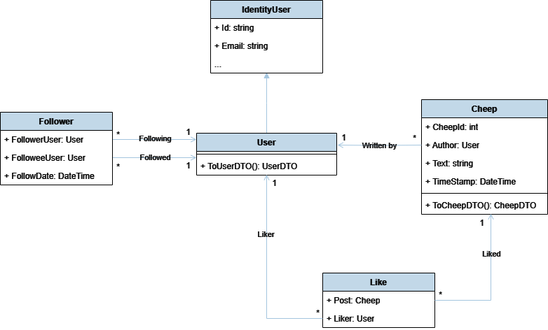
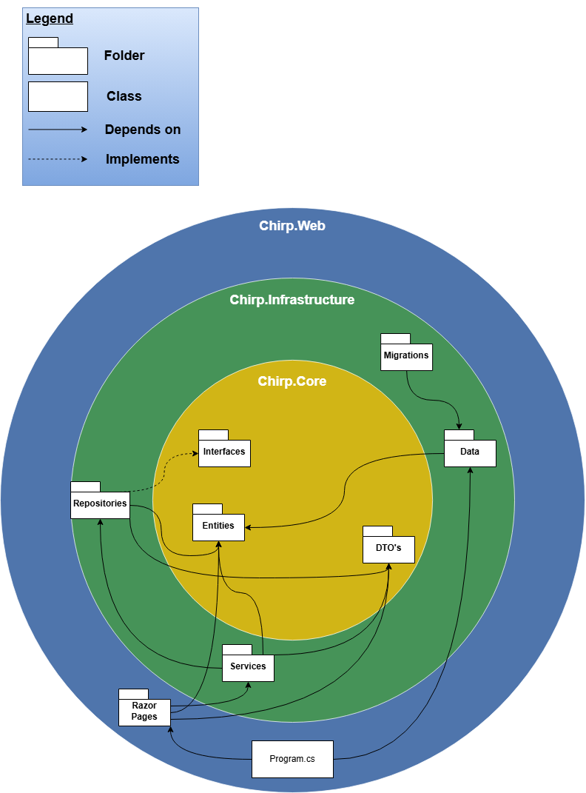
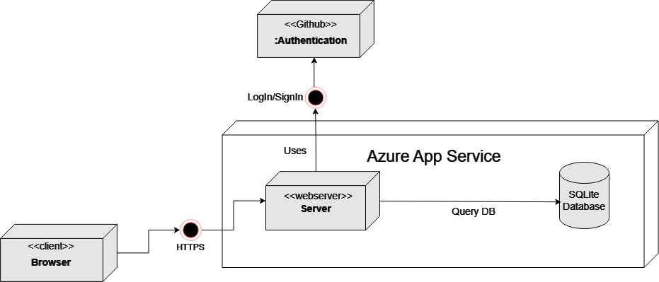
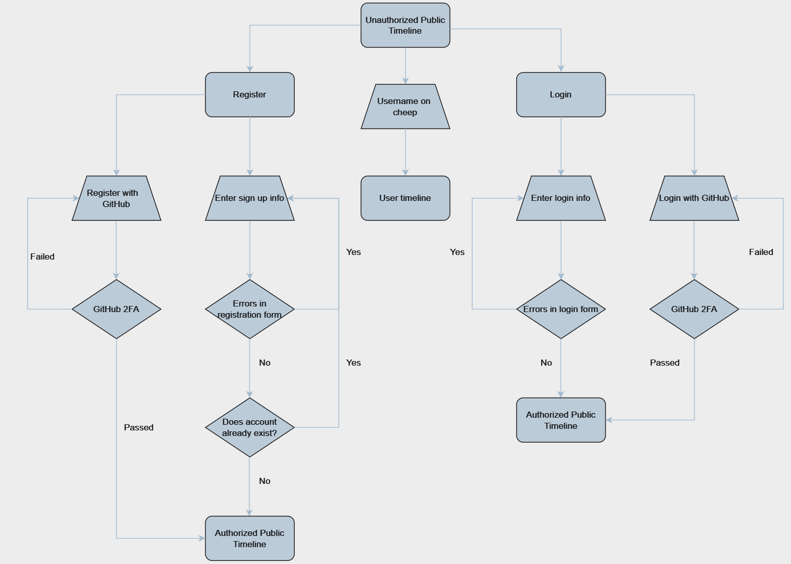
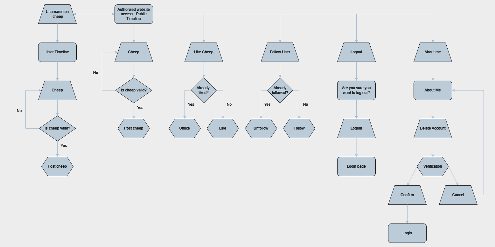
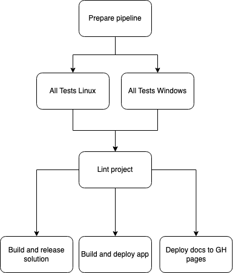

# Design and architecture

## Domain model
The centerpiece of our domain model is the User class. It inherits from the ASP.NET's IdentityUser class allowing us to use ASP.NET Identity to manage our users. This offloads a lot of heavy lifting such as login, registration and authentication, instead letting us focus on developing other essential features for Chirp. All other classes in the domain model are dependent on the User class. Whether it be a Cheep requiering an author, or a Like requiring a liker, they all must reference an instance of a User. This, in combination with ASP.NET Identity, makes it easy to verify that only authenticated users can interact with the site, such as following people, writing or liking cheeps. An illustration of our domain model can be seen below:

{width=80%}

## Architecture — In the small

The architecture of our Chirp application is based on the "Onion Architecture" pattern. This pattern is a layered architecture that enforces seperation of concers and invites a clear dependency flow. The following diagram illustrates the layers of our application and the dependencies between them:

{width=80%}

At the center of the application is the **Core** layer. This layer contains the domain model, interfaces, and DTOs. As seen in the diagram, the "Core" layer is dependent on nothing, but is depended on by many other layers. This is, as mentioned, a key principle of the Onion Architecture pattern.

The **Infrastructure** layer is responsible for data access, migrations, seeding, and our services. This layer is dependent on the **Core** layer, as it needs to interact with the domain model.

The outermost layer is the **Web** layer. This layer is resposible for delivering the application to the user. It uses ASP.NET Core to handle HTTP requests and is responsible for rendering the pages. Furthermore, it has the application's entry point, the `Program` class, which is responsible for configuring the application and starting the server.

## Architecture of deployed application

- Illustrate the architecture of your deployed application.
- Remember, you developed a client-server application.
- Illustrate the server component and to where it is deployed, illustrate a client component, and show how these communicate with each other.

{width=80%}

Our Chirp application uses an Microsoft Azure server and is deployes using this. 


## User activities

In the following section, multiple UML diagrams will visualize the possible journeys through the application. 
Before showing how a user can interact with the chirp application, the diagrams are going to follow these different legends:

{width=80%}

To show how a user can interact can interact with the website while being logged out, we have made an 'Unauthorized' UML diagram:

{width=80%}

When a user has logged in or signed up, they now have authorized access. This grants the user more possibilities on the Chirp platform visualized in the 'Authorized' UML diagram:

{width=80%}

To see the full picture of how it all works together in tandem the whole application is laid out in 'Complete' UML diagram:

{width=80%}

## Sequence of functionality/calls trough _Chirp!_

- With a UML sequence diagram, illustrate the flow of messages and data through your _Chirp!_ application.
- Start with an HTTP request that is send by an unauthorized user to the root endpoint of your application and end with the completely rendered web-page that is returned to the user.

- Make sure that your illustration is complete.
- That is, likely for many of you there will be different kinds of "calls" and responses.
- Some HTTP calls and responses, some calls and responses in C# and likely some more.
- (Note the previous sentence is vague on purpose. I want that you create a complete illustration.)

# Process

## Build, test, release, and deployment

- Illustrate with a UML activity diagram how your _Chirp!_ applications are build, tested, released, and deployed.
- That is, illustrate the flow of activities in your respective GitHub Actions workflows.

- Describe the illustration briefly, i.e., how your application is built, tested, released, and deployed.

{width=80%}

Building, testing, releasing and deploying our application is all done via our pipeline. The first step of our pipeline is preparing it. This includes declaring different variables that the pipeline uses to dertermine which jobs and steps to run and which not to. When the pipeline runs on the `main` branch, the entire pipeline is run through. This includes releasing our program and deploying our application and docs. When the pipeline runs on the `staging` branch, the pipeline will skip the deploying jobs, since a staging slot in Azure cost money and we don't want docs for our pre-release. The release it creates will be a pre-release inlcuding the short SHA of the latest commit in the version, still following the SemVer version scheme. Every other branch runs testing and linting and skips relasing and deploying.

## Team work

- Show a screenshot of your project board right before hand-in.
- Briefly describe which tasks are still unresolved, i.e., which features are missing from your applications or which functionality is incomplete.

When a contributor wants to create a new issue, the first thing they will do is go to the GitHub repository and find the `Issues` sections. The contributor will then find and click on the `new issue` button and will be promted to select an issue template, where in our case there is only 1. The template will help them fill out the issue in a generic way with a issue description and some acceptance criteria if necessary. When the issue is created, it will soon be labeled and assigned to a developer aswell as our Chirp project board. On the project board it will also be given a status, priority aswell as an optional week, start date and end date. We also use milestones to keep track of when issues need to be done. As an example our milestones was the project reviews and the project presentation.

The issue is now ready for a contributor to pickup and start working on. First step is to branch out from our `staging` branch to create a new feature branch. This branch needs to follow the naming conventions described in the [README.md](https://github.com/ITU-BDSA2024-GROUP22/Chirp/README.md#branch-naming-conventions). When the development of the issue progresses, the contributor will update the acceptance criteria marking them complete, aswell as clear out any complications that might occur under development. When all acceptance criteria are marked completed, the contributor will create a pull request from the feature branch back into the `staging` branch. On all branches, our pipeline (GitHub workflow) will run all our tests as well as lint our code on every commit. This workflow needs to complete successfully before a merge from the feature branch is available, aswell as atleast 2 people needs to review and accept the incoming changes in the pull request. When the pull request is merged into `staging`, our pipeline will be triggered for the staging branch that runs all the same steps aswell as creating a pre-release for the version. The pipeline includes a version check against the [official SemVer regex](https://semver.org/#is-there-a-suggested-regular-expression-regex-to-check-a-semver-string). If this fails, the pipeline will crash berfore creating the pre-release.

When necessary, we will make sure everything works as expected on the `staging` branch, creating new test for errors we find and at last create a pull request from `staging` into our `main` branch. When the pull-request is accepted, it will again trigger our pipeline wich will automatically verify the version again and also make sure that no previous releases exists of that version. If everything is fine, our pipeline will create a release. We then update the release note to include all changes made referencing the issues we resovled in this version bump. The pipeline will also deploy our new version of the application to Azure.

## How to make _Chirp!_ work locally
To run and clone the project you need the following prerequisites:
- .NET 7 (for running the application)
    - [Installation link](https://dotnet.microsoft.com/en-us/download/dotnet/7.0)
    - [Setup guide](https://learn.microsoft.com/en-us/dotnet/core/install/)

- Git CLI (for cloning the repository)
    - [Installation link](https://git-scm.com/downloads)
    - [Setup guide](https://git-scm.com/book/en/v2/Getting-Started-Installing-Git)

After the installation of the prerequisites, you can clone the repository by running the following command in your terminal:

```bash
git clone https://github.com/ITU-BDSA2024-GROUP23/Chirp.git
```
Now that you have cloned our repository, you should navigate to `Chirp.Web` by running the following command in your terminal:

```bash
cd ./Chirp/src/Chirp.Web
```

Before running the application, you need to set up trhe GitHub oAuth secrets. This can be done by running the following commands in your terminal:

```bash
dotnet user-secrets set "GH_CLIENT_ID" <YOUR_GITHUB_CLIENT_ID>
dotnet user-secrets set "GH_CLIENT_SECRET" <YOUR_GITHUB_CLIENT_SECRET>
```

Replace `YOUR_GITHUB_CLIENT_ID` and `YOUR_GITHUB_CLIENT_SECRET` with your own GitHub oAuth application secrets. If you haven't already created a GitHub oAuth application it can be done [here](https://github.com/settings/applications/new). It is important that the callback URL is `http://localhost:5273/auth/github` and the homepage URL is `http://localhost:5273`.

Finally, you can run the application by running the following command in your terminal. Please make sure you are in the `Chirp.Web` directory:

```bash
dotnet run
```

## How to run test suite locally

If you haven't already, please refer to the ["How to make _Chirp!_ work locally"](#how-to-make-chirp-work-locally) section to set up the prerequisites for installing .NET 7, Git CLI, and cloning the repository. Also, make sure you have set up the GitHub oAuth secrets as also described in the previous section.

1. Install PowerShell if you haven't already.
    - Instructions for installing PowerShell can be found [here](https://learn.microsoft.com/en-us/powershell/scripting/install/installing-powershell?view=powershell-7.4).
2. Navigate to the root of the project in your terminal.
    ```bash
    cd ./Chirp
    ```
3. Make sure Playwright is installed - if not, run the following command in the root of the project:

    ```bash
    pwsh test/PlaywrightTests/bin/Debug/net7.0/playwright.ps1 install --with-deps
    ```
4. Run the tests

    ```bash
    dotnet test
    ```

The tests should run and you should see the results in the terminal.

# Ethics 

## License

We are using an Apache 2.0 license.

## LLMs, ChatGPT, CoPilot, and others
In the development of _Chirp!_ we have used two different large language models (LLMs) to help us with the development. The first one being GitHub Copilot and the second one being ChatGPT. While Copilot was being used constantly for small code completions, ChatGPT was more useful for finding ways to attack an issue or finding libraries to solve an issue. 

The responses of ChatGPT were often wrong or incomplete, since it didn't have the full picture of the project. This meant that we had to remain critical of the responses, and not just blindly accept the answer. Since the responses were often wrong, we had to spend more time on the issue than if we had just solved it ourselves. The use of Copilot was more successful, since it was used for small code completions, where the context was clear, which sped up the development process.


